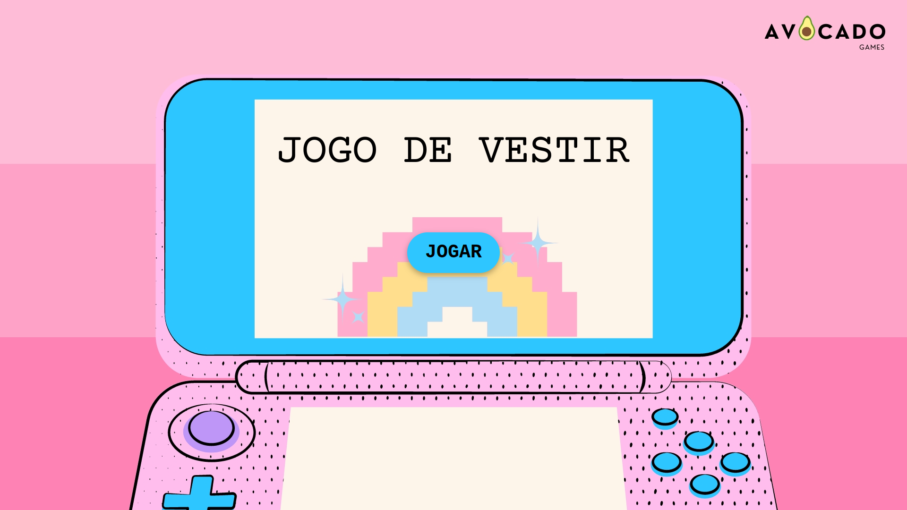
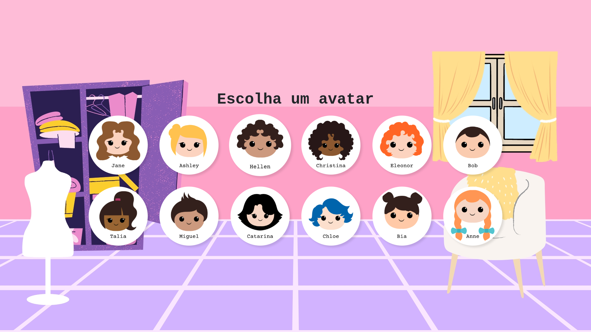
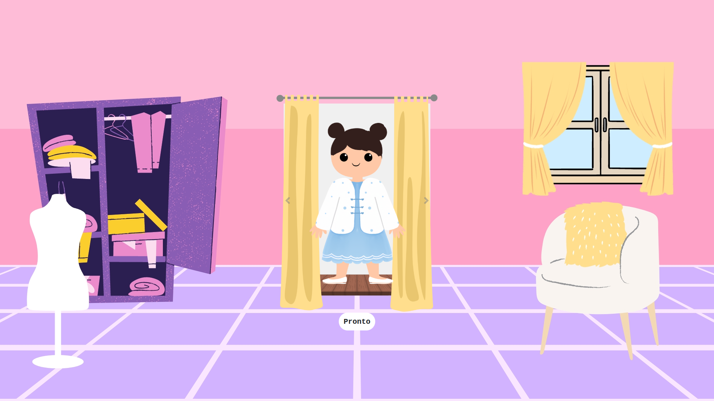
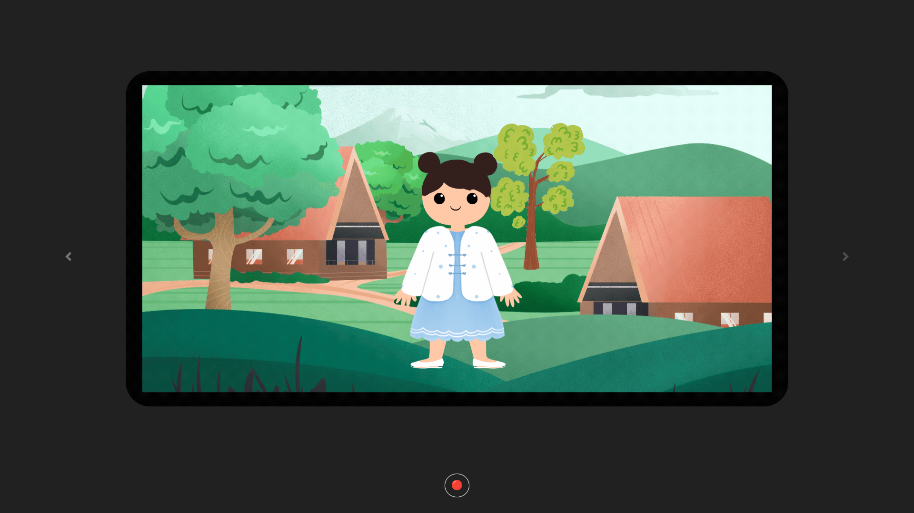

  

  <h1>👗 Jogo de vestir</h1>

  

    Um jogo de vestir interativo, onde você cria looks incríveis e salva o resultado em uma foto.
  

  

    
  

  

    
    
    
    
  

 

## Sobre o projeto

Nesse minijogo, o usuário escolhe um personagem para vestir, navega por uma boutique estilizada, escolhe entre diversas opções de roupas e acessórios através de um carrossel interativo e, ao final, pode gerar uma foto do look criado para salvar ou imprimir.

## Funcionalidades

| 1. Menu inicial | 2. Avatares disponíveis |
|:---:|:---:|
|  |  |
| Menu imersivo estilo boutique. | Seleção de uma variedade de personagens. |

| 3. Montagem de look | 4. Câmera fotográfica |
|:---:|:---:|
|  |  |
| Sistema de carrossel para a navegação entre as peças de roupa. | Gera uma visualização limpa pronta para impressão/download. |

## Tecnologias utilizadas

* **HTML5 & CSS3:** Estrutura semântica, Grid Layout e animações CSS.
* **JavaScript:** Lógica de seleção de roupas e manipulação do DOM.
* **Bootstrap:** Componentes de interface (Carrossel e botões).
* **Window Print:** Utilizado para a funcionalidade de tirar foto do look final.

## Autora

<a href="https://github.com/brininha">    <b>Sabrina Cristan</b> </a>

